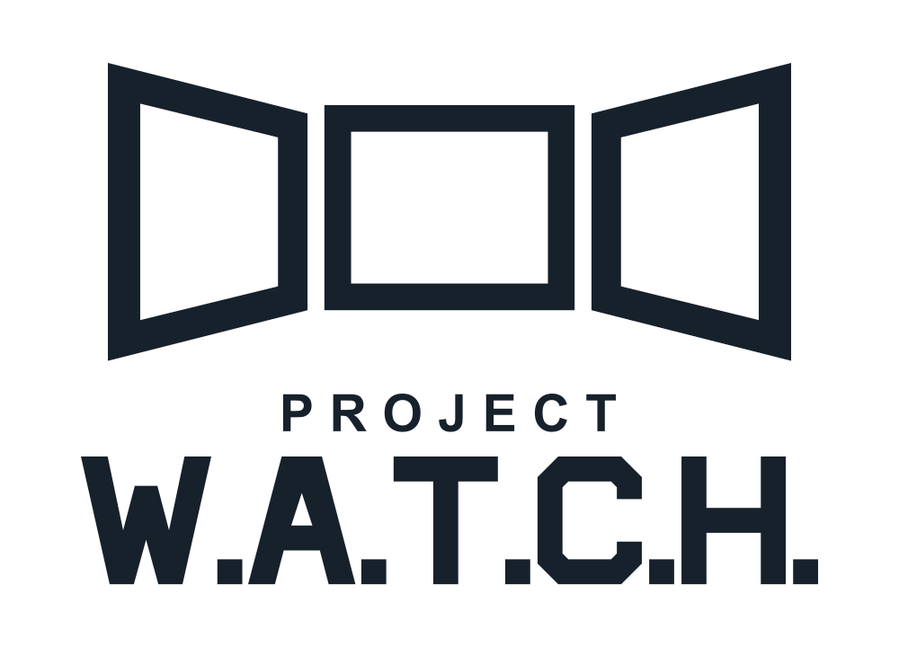
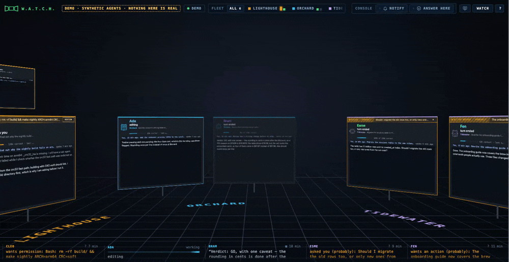
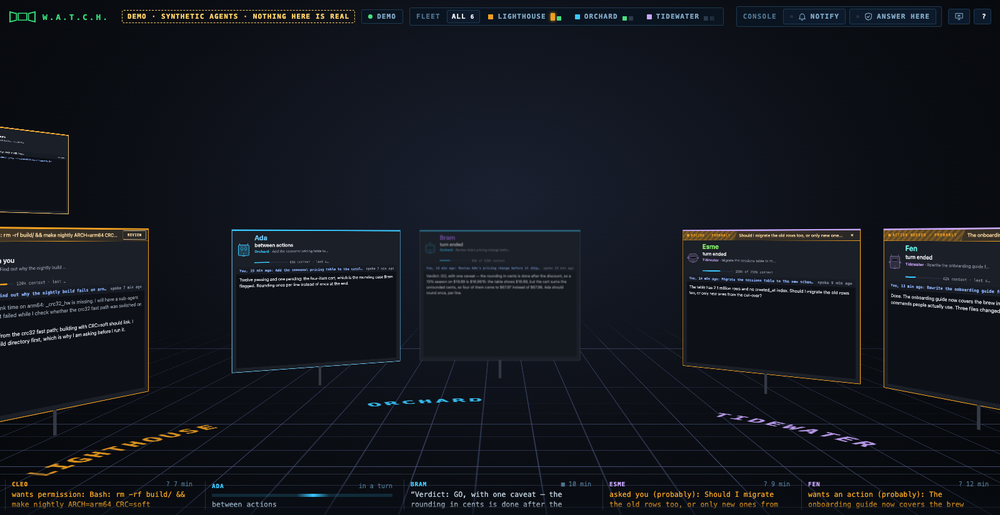
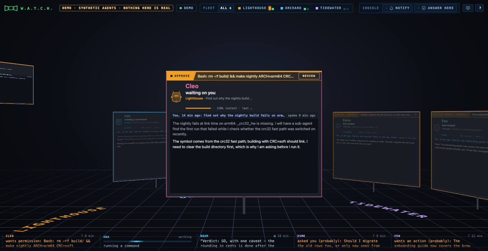
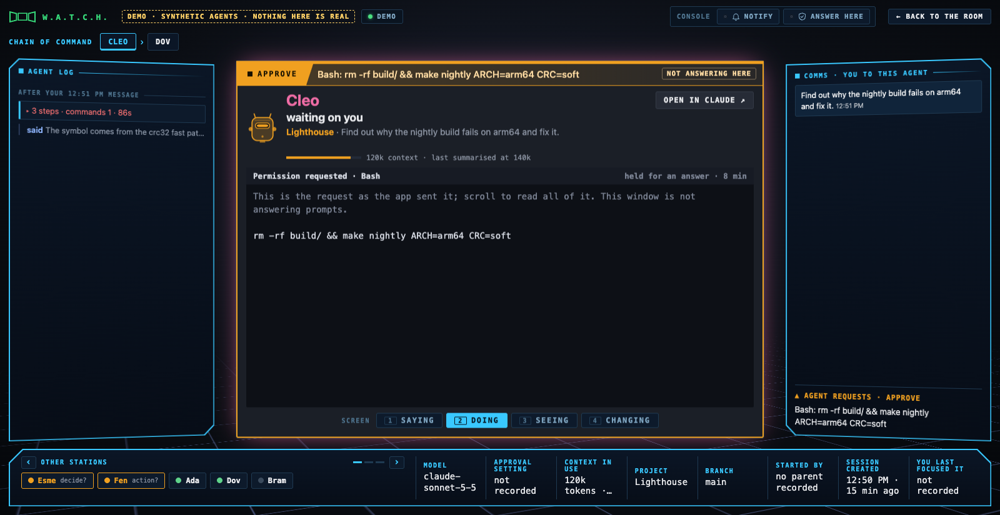

<p align="center">
  <picture>
    <source media="(prefers-color-scheme: dark)" srcset="docs/media/logo-green.svg">
    
  </picture>
</p>

<p align="center">
  <b>Window on Agents, Tools, Changes and Hand-offs.</b><br> A room of monitors, one per coding agent, showing what each one is doing <i>while</i> it is doing it.
</p>

<p align="center">
  <a href="LICENSE"></a> <a href="COMMERCIAL.md"></a>    <a href="#status"></a>
</p>

<p align="center">
  <a href="#try-it">Try it</a> &middot; <a href="#what-you-can-see">What you can see</a> &middot; <a href="#what-you-cannot-see">What you cannot</a> &middot; <a href="#trust-boundary">Trust boundary</a> &middot; <a href="#status">Status</a> &middot; <a href="docs/ROADMAP.md">Roadmap</a> &middot; <a href="#license">License</a>
</p>

<p align="center">
  
</p>

> **Early.** macOS. Python 3 standard library, no dependencies, one HTML page. Watching is safe to try today; read the [trust boundary](#trust-boundary) before switching on anything that answers prompts.

## Why this exists

You can run several coding agents at once now. What you cannot easily do is watch them. Each one lives in its own terminal or app window, and the record of what it did is a transcript you read afterwards, once it has finished building the thing. By then the decision you would have questioned is three steps back, and the file it should not have touched has already changed.

W.A.T.C.H. is situational awareness for the time in between. Claude Code and Codex both write a session log as they work. W.A.T.C.H. reads those logs as they are written and turns them into a room you can stand in: one monitor per agent, each showing what that agent has open, what it just ran, what it changed, what it said, and whether it is waiting on you. You glance along the row the way you would glance along a row of desks. When one of them needs a look, you step up to it.

Today it watches, and does one thing more: with the hooks installed and a window switched on for it, it can answer a Claude Code permission prompt. It does not drive the agents, and it is not a chat window; it is the window beside their windows. (It suits a second screen, left open while you work with the agents on the first.) Where it is going is a command post, one room where you both see your agents and act on them, across providers. The [roadmap](docs/ROADMAP.md) sets that out, and the rules do not change on the way: the person stays in charge, every action is opt-in, and the page never claims more than the log confirms.

## What you can see

Everything on screen comes from the two tools' own records: their session logs, the messages the optional hooks send, and the apps' metadata files (session titles, settings, when you last focused a session). Rendered previews are read from disk at the moment they are shown. Each item is labelled by how it got there.

- **Per agent, as it happens:** what it is saying, as the log records each message; the file it has open, edits shown as diffs, commands and their output; your messages to it; and a rendered preview of any HTML it writes. In the room and in hand, a monitor shows the narration with your last message to that agent pinned above it in one line, so you know what you asked without stepping up.
- **Who is waiting on you**, and for what: a permission prompt, a question, a plan to approve. These are recorded facts, from the log or from a hook message, shown with the request text.
- **Who is working**, with the step that is open, for as long as the turn runs.
- **Who stopped, and where:** an idle monitor carries a caption with the agent's last words, a failed last step, or the request it is waiting on.
- **The goal:** each monitor carries the first message of the session that was read, as a one-line reminder of what that agent is for.
- **Who started whom:** a chain of command, marked where it was recorded and where it was inferred.
- **Which project:** the row is seated in bays by folder, with the project's name set into the floor, and you can give a folder a display name.
- **Alerts** when a command looks like a deploy, a push, a delete or a send, from a small shell-aware parser.
- **Readouts** the log states: model, branch, approval setting, context in use, when the session began, when you last spoke to it.

The desk for one agent has four screens on its monitor, Saying, Doing, Seeing and Changing, and you land on the one you were reading. Beside it, a timeline of what the agent did and said, in order, grouped under each of your messages, with each turn's end marked; click a step to see it on the monitor, or a said line to open it on the Saying screen. Then the other agents at a glance and a five-minute activity strip coloured by kind of action.

## What you cannot see

The room shows what those records contain and nothing else. That rules some things out, and the page says so rather than guessing.

- **Not the agent's reasoning.** Hidden thinking is not in the logs, so it is never shown or paraphrased.
- **Not keystrokes.** Granularity is a tool call, a result, a message, a turn boundary. A step in flight is shown as open, not as a progress bar.
- **Not "idle".** "No log entry for N" means the log is silent. Silence is not proof of anything.
- **Not "done".** A command whose exit code is not recorded is shown as *returned*, not done.
- **Not certainty about parents.** "Started by" is *recorded* when the log says so and *inferred* when it was worked out from a launch command, and the label says which. A guess from script text is shown as "possibly started by" and is never stored.
- **Not Codex's private channels.** Messages between Codex agents are encrypted in its log; its permission prompts and queued messages are not visible.
- **Not the future.** "Probably needs you" notices read the agent's last sentences and can be wrong either way.

## Try it

Two minutes, no install.

```bash
git clone https://github.com/glo6al/project-watch.git && cd project-watch
python3 src/server.py
```

Then open <http://127.0.0.1:8793/> and press **Unlock**. The server asks your default browser to open a new, unlocked tab, and the room fills with whatever Claude Code or Codex sessions have been active in the last twenty minutes (`WINDOW_MIN` to change that, `PORT` to move it).

**No sessions of your own?** Open <http://127.0.0.1:8793/?demo>. A synthetic fleet of fictional agents on fictional projects plays through a sample of what the room can show: working, waiting on you, a question, a hand-off, a sub-agent, last words. One agent holds a permission request you can answer on the page: click its APPROVE tag, then Allow or Deny, and a scripted outcome follows; nothing is sent anywhere, and the switches in the bar work on the page only. There is no rendered preview and no summarisation marker. The demo page reads no logs and needs no key, and the bar says so. The server behind it is the ordinary one: it still creates its key and follows your real logs in the background, because it is the same process; after loading its page and icons, the demo makes no live-data or action requests to it, and it keeps its own project names rather than this browser's.

**Optional hooks** (Claude Code only). In a second terminal, while the server is running:

```bash
python3 scripts/install_hooks.py            # --remove to undo
```

If you moved the server with `PORT`, run the installer with the same `PORT` and open the page on that port. The server, the hooks and the browser must all agree on it.

This adds Notification, Stop, SubagentStop and PermissionRequest hooks to your Claude Code settings. The first three only tell the room things sooner than the log would. The fourth lets the room answer permission prompts for you, and is off until you switch it on in a window. Read the [trust boundary](#trust-boundary) first.

**Moving around:** two-finger scroll or drag to turn, or the arrow keys. Hover a monitor and it comes to your hand; click it to step up to its desk. Escape, or "Back to the room", to step back.

## The room, and the desk

<p align="center"></p>
<p align="center"><sub><b>The room.</b> One monitor per agent, seated by project. The ledge along the bottom says where each idle agent stopped and shows a sweeping rail for each one that is working.</sub></p>

<p align="center"></p>
<p align="center"><sub><b>In hand.</b> Hover and the monitor comes to you and stays put while you turn the camera, showing what the agent is saying under your last message to it. The banner across its top is the permission request it is waiting on; click its tag to open it at the desk.</sub></p>

<p align="center"></p>
<p align="center"><sub><b>The desk.</b> Everything the log records about one agent: four screens on the monitor, the timeline of steps and words beside it, the chain of command along the top and the readouts along the bottom. In the live room, Allow and Deny send your decision to the waiting agent; in the demo the page scripts the outcome. "Not recorded" means exactly that.</sub></p>

## How it works

- **The server** (`src/server.py`, one file, standard library only) follows `~/.claude/projects/**.jsonl` and `~/.codex/sessions/**.jsonl`, turns each record into an event, and streams events to the page over server-sent events on 127.0.0.1. It listens on loopback only, talks to nothing but your browser, and reports nothing anywhere. Rendered previews are the one place agent-written code runs; the trust boundary below says what they can and cannot reach.
- **The page** (`src/web/index.html`, one file, no build step) draws the room with CSS 3D transforms. The camera stands where it would for five monitors and never backs away, so the monitors in front of you stay readable however many agents there are; the rest of the row curves out of frame and you turn to it. The fleet strip at the top is the map: one chip per project, one lit cell per agent.
- **The hooks** (`scripts/install_hooks.py`) are small shell commands Claude Code runs at Notification, Stop, SubagentStop and PermissionRequest. They post to the server with the key from a private header file.
- **Everything in a log is treated as untrusted.** An agent can write anything into its own transcript. Counts are validated and text is escaped before it reaches the page, and the page's script runs under a per-request nonce so that nothing arriving as data can run even where an escape is missed.
- **Faces:** each monitor's avatar is a machine head drawn from the session id, so an agent looks the same every day. Its visor light only repeats what the monitor border says: scanning while a step is open, steady while the agent waits on you, dim between steps, dark when the log is silent. It has no expressions, because the logs record none.
- **Project names:** a folder can be shown under another name by listing it in `~/.live-room/projects.json` as `{"folder name": "shown as"}`, read when a window connects. Double-clicking a chip sets a name for that browser only. Neither is in the public files.
- **Links between agents**, once made, are kept in `~/.live-room/links.json` (agent ids, the parent, a one-line reason, and whether it was recorded or inferred; never prompt text or folders) and restored at start-up. A recorded link replaces an inferred one; an inferred one never replaces anything; a stored link is dropped after thirty days without the child being seen. "Unlink" at the desk drops a stored inferred link.

## Trust boundary

Read this before relying on Allow / Deny.

- Binds to 127.0.0.1; rejects other Host and Origin headers; cannot be framed.
- The key in `~/.live-room/key` is required by `/events`, `/check`, `/decide`, `/open`, `/presence`, `/hook`, `/permission`, `/keep` and `/unlink`. Four things do not use it: `/pair` (unauthenticated; it only asks your default browser to open an unlock tab, at most once a minute, and returns nothing to the caller), `/claim` (trades the one-time code from that tab for the key, once), `/fs/<preview key>/…` (a separate per-run key that is only good for previews) and `/static/<name>` (the page's own four icon files, by exact name).
- The hooks send the key to whatever is listening on the port. Stopping another local program from taking that port while W.A.T.C.H. is not running is outside what this tool can do.
- The key file and its directory are forced to private permissions at start. The hooks send the key from a private header file, so it does not appear in any process's arguments. It does sit in the page's localStorage and in the query string of the page's own `/events` and `/check` requests.
- A program that can read `~/.live-room/`, or drive your browser, can do what you can do here, including approving a prompt. Protecting against that needs an OS-level boundary this tool lacks.
- **Answering prompts is off by default.** It is switched on per window ("Answer prompts here"). A prompt is held only while such a window is visible and has checked in within ~12 seconds, only if the request is short enough to be shown in one scrolling panel (up to 20,000 characters and 600 lines; you may still have to scroll to read all of it), for at most one minute. An agent's question to you is never held, because Allow or Deny cannot answer it. Otherwise the hook returns no decision. (The hook's own timeouts are longer, about five and a half minutes: if the server itself stalls while holding a request, Claude may wait that long, not one minute.) While answering is on, every Claude session's permission requests wait here first, including sessions you are not watching. What Claude does with no decision is Claude's business: normally it asks in the app, but a context that cannot show a prompt may deny.
- Allow and Deny exist only in a window with answering switched on, while that one request is the thing on the agent's screen with no panel over it. Each request gets its own pair of buttons, which ignore clicks for the first half second. The hook prints an answer only if it arrived whole. curl is told to ignore proxies and `~/.curlrc`. Prompts that reach the room only as a notification (sandbox network access, for example) are shown with "answer it in the app" and cannot be answered here.
- Rendered previews: an HTML file is served only if an agent's successful write was seen for it, it is a regular file reached without symlinks, it is outside private folders, and it is still the same file. Beside such a page, styles, scripts, images and fonts in the same folder tree are served, opened one path component at a time with symlinks refused, from the same folder (by identity) that was granted. Previews run sandboxed under a content policy that blocks other origins. That limits what a preview can fetch; it is not a guarantee that nothing can leave the machine.
- Unlocking opens a private file holding a one-time code (good for two minutes, then deleted; leftovers are removed at start), which the page trades for the key. Anything on this machine can still ask for an unlock tab to be opened, at most once a minute.

## Status

Early, and in daily use by its author. Every change that touches the key, the hooks, Allow / Deny or rendered previews is red-teamed by a different model from the one that wrote it before it is relied on. The [roadmap](docs/ROADMAP.md) lists what has been proven, what has not, what is known and left as it is, and what comes next. Rendering with many agents and large previews has not been profiled, and phone-width windows are not supported.

## Project layout

    src/server.py            the server: follows the logs, serves the page, holds permission prompts
    src/web/index.html       the room (one page, no build step)
    scripts/install_hooks.py adds or removes the Claude Code hooks
    docs/ROADMAP.md          what is planned and what is unproven
    docs/media/              the images in this file, all from demo mode

## Contributing and reporting

Issues and pull requests are welcome. Two habits keep this project honest, and a change that breaks either will be sent back:

- **Label the source.** Recorded is not inferred, running is not finished, failed is not blocked, absent is not zero, and unknown is not success. If the log does not say it, the page does not claim it.
- **Review before trust.** Anything that touches the key, the hooks, Allow / Deny or previews gets an independent adversarial review before it is relied on, and the roadmap says what has and has not been proven.

If you find a way for a log, a preview or another local program to do something this README says it cannot, please report it privately through the repository's security advisory page rather than in a public issue.

## Credits

Built by its owner with AI coding agents, and reviewed before each release by a different model from the one that wrote the change.

## License

Free for personal and other noncommercial use, under the [PolyForm Noncommercial License 1.0.0](LICENSE). That covers you, your side projects, charities, schools and public bodies, and lets you read, run, change and share the code for those purposes.

Any use that is not a noncommercial purpose under the license's own terms needs a commercial license. See [COMMERCIAL.md](COMMERCIAL.md) for what that covers and how to ask. This is source-available, not open source in the OSI sense, and that is a deliberate choice.
